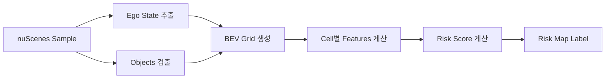

# BEV Risk Map Label Specification

## 📋 Overview

본 문서는 nuScenes 데이터셋을 기반으로 생성되는 **BEV (Bird's Eye View) Risk Map Labels**의 상세 사양을 정리합니다.

**목적**: 자율주행 차량의 폐색(occlusion)으로 인한 잠재적 위험 영역을 BEV 공간에서 정량화

**버전**: V5 (Continuous Function Method)
**최종 업데이트**: 2025-11-18

---

## 🗂️ 1. 데이터셋 정보

### 1.1 원본 데이터셋: nuScenes

| 항목 | 내용 |
|------|------|
| **데이터셋 이름** | nuScenes Dataset |
| **제공 기관** | Motional (formerly nuTonomy) |
| **데이터 타입** | 자율주행 센서 데이터 (LiDAR, Camera, Radar) |
| **지역** | Boston, Singapore |
| **환경** | 도심, 주거지역, 고속도로 등 |
| **날씨/시간** | 주간, 야간, 비, 맑음 등 다양한 조건 |

### 1.2 사용 버전

#### v1.0-mini (테스트/개발용)
```
- Scenes: 10개
- Samples: 404개
- 용도: 알고리즘 테스트, 파라미터 튜닝
- 크기: ~4GB
```

#### v1.0-trainval (전체 데이터셋)
```
- Scenes: 850개
- Samples: 34,149개
- 용도: 모델 학습 및 검증
- 크기: ~350GB (원본), ~15GB (risk labels)
```

### 1.3 데이터 구조

```
nuscenes/
├── v1.0-mini/          # 메타데이터 (JSON)
├── v1.0-trainval/      # 메타데이터 (JSON)
├── samples/            # 카메라 이미지
│   ├── CAM_FRONT/
│   ├── CAM_FRONT_LEFT/
│   └── ...
├── sweeps/             # LiDAR sweeps
└── maps/               # HD maps
```

---

## 🎯 2. 라벨링 개요

### 2.1 라벨링 대상

**입력**: nuScenes의 각 sample (keyframe, 2Hz 샘플링)
**출력**: BEV Risk Map (200×200 grid)

### 2.2 라벨 생성 프로세스



**단계별 설명**:

1. **Sample 로드**: nuScenes에서 sample 데이터 추출
2. **Ego State**: 자차 위치, 속도, 방향 계산
3. **Object Detection**: GT annotations에서 주변 객체 추출
4. **BEV Grid**: 200×200 그리드 생성 (0.5m 해상도)
5. **Feature Computation**: 각 셀별 6가지 특징 계산
6. **Risk Scoring**: V5 continuous function으로 위험도 계산

### 2.3 주요 특징

- ✅ **Ground Truth 기반**: nuScenes GT annotations 사용
- ✅ **실시간 계산 가능**: 단순한 수식 기반 (딥러닝 X)
- ✅ **해석 가능**: 각 요소(O, U, P)의 의미가 명확
- ✅ **파라미터 조정 가능**: 시나리오별 튜닝 가능

---

## 📐 3. BEV Grid 사양

### 3.1 Grid 설정

```python
CONFIG = {
    'bev_range': [-50, 50, -50, 50],  # [x_min, x_max, y_min, y_max] meters
    'bev_resolution': 0.5,             # meters per pixel
    'bev_h': 200,                      # height (pixels)
    'bev_w': 200,                      # width (pixels)
}
```

### 3.2 좌표계

**Ego-centric Coordinate System**:
- **원점 (0, 0)**: 자차(ego vehicle) 위치
- **X축**: 전방 방향 (forward)
- **Y축**: 좌측 방향 (left)
- **범위**: -50m ~ +50m (전방향)

```
        Y (left)
         ↑
         |
    -50m |-------|-------|-------| +50m
         |   3   |   2   |   1   |
         |-------|-------|-------|
    -25m |   6   |   5   |   4   |
         |-------|-------|-------|
      0m |   9   | (EGO) |   7   | → X (forward)
         |-------|-------|-------|
    +25m |  12   |  11   |  10   |
         |-------|-------|-------|
    +50m |  15   |  14   |  13   |
         |-------|-------|-------|
       -50m    -25m     0m    +25m   +50m
```

### 3.3 Grid → World 변환

```python
def grid_to_world(grid_x, grid_y, config):
    """
    Grid 좌표를 World 좌표로 변환

    Args:
        grid_x, grid_y: Grid indices [0, 199]

    Returns:
        world_x, world_y: World coordinates in meters
    """
    x_min, x_max, y_min, y_max = config['bev_range']
    resolution = config['bev_resolution']

    world_x = x_min + grid_x * resolution
    world_y = y_min + grid_y * resolution

    return world_x, world_y
```

---

## 🧮 4. Risk Calculation (V5 Algorithm)

### 4.1 수식

**V5 Continuous Function Method**:

```
R = I_traj × O × U × P
```

여기서:
- **I_traj**: Trajectory indicator (0 or 1, 하드 필터)
- **O**: Occlusion factor [0, 1]
- **U**: Urgency factor [0, 1]
- **P**: Proximity factor [0, 1]

### 4.2 각 요소 상세

#### I_traj: Trajectory Indicator

**목적**: 경로 밖 셀 필터링

```python
I_traj = 1  if (is_on_trajectory AND is_future)
         0  otherwise
```

**조건**:
- `is_on_trajectory`: distance_to_trajectory ≤ d_traj_max (20m)
- `is_future`: temporal_position > 0 (전방)

#### O: Occlusion Factor

**목적**: 폐색 정도 정량화

```python
O = min(occluder_area / A_ref, 1.0)
```

**파라미터**:
- `occluder_area`: 폐색 물체의 면적 (width × length, m²)
- `A_ref = 10.0 m²`: 기준 면적 (큰 트럭 크기)

**예시**:
```
작은 차량 (2m × 4m = 8 m²)  → O = 0.8
큰 트럭   (2.5m × 6m = 15 m²) → O = 1.0 (capped)
```

#### U: Urgency Factor (Time-to-Collision)

**목적**: 시간적 긴급도

```python
if TTC ≥ T_safe:        U = 0.0
elif TTC ≤ T_critical:  U = 1.0
else:                    U = (T_safe - TTC) / (T_safe - T_critical)
```

**파라미터**:
- `T_safe = 10.0s`: 안전 시간 (위험 없음)
- `T_critical = 2.0s`: 임계 시간 (매우 위험)

**예시**:
```
TTC = 12s → U = 0.0   (안전)
TTC = 6s  → U = 0.5   (중간)
TTC = 1s  → U = 1.0   (위험)
```

#### P: Proximity Factor (Distance to Trajectory)

**목적**: 경로로부터의 좌우 거리

```python
if dist ≤ d_close:     P = 1.0
elif dist ≥ d_far:     P = 0.0
else:                   P = (d_far - dist) / (d_far - d_close)
```

**파라미터**:
- `d_close = 5.0m`: 경로 상 (차선 내)
- `d_far = 20.0m`: 경로 밖 (인접 차선 밖)

**예시**:
```
dist = 2m  → P = 1.0   (경로 상)
dist = 10m → P = 0.67  (경로 근처)
dist = 20m → P = 0.0   (경로 밖)
```

### 4.3 전체 파라미터 설정

```python
CONFIG = {
    'risk_params': {
        # Trajectory corridor (좌우 필터)
        'd_traj_max': 20.0,      # meters

        # Occlusion
        'A_ref': 10.0,           # m²

        # Urgency (TTC)
        'T_safe': 10.0,          # seconds
        'T_critical': 2.0,       # seconds

        # Proximity (좌우 거리)
        'd_close': 5.0,          # meters
        'd_far': 20.0,           # meters
    }
}
```

### 4.4 계산 예시

**시나리오**: 30m 전방, 3m 좌측에 트럭으로 가려진 셀

**입력**:
- `occluder_area = 15.0 m²` (트럭)
- `TTC = 5.18s` (30m / 5.79m/s)
- `distance_to_trajectory = 12.98m`

**계산**:
```
O = min(15.0 / 10.0, 1.0) = 1.0          (완전 폐색)
U = (10.0 - 5.18) / (10.0 - 2.0) = 0.602 (중간 긴급도)
P = (20.0 - 12.98) / (20.0 - 5.0) = 0.468 (경로 근처)

R = 1 × 1.0 × 0.602 × 0.468 = 0.282
```

**해석**: 중간 정도의 위험 (0.282)

---

## 📦 5. 라벨 데이터 형식

### 5.1 파일 구조

```
data/emergence_risk_v5_full/
├── risk_labels_train.pkl      # Train set labels
├── risk_labels_val.pkl        # Val set labels (optional)
└── risk_config.json           # Configuration
```

### 5.2 Pickle 파일 형식 (risk_labels_train.pkl)

**Top-level structure**: `Dict[str, List[Dict]]`

```python
{
    '<scene_token_1>': [
        {  # Sample 1
            'sample_token': str,
            'scene_token': str,
            'scene_name': str,
            'risk_map': np.ndarray,  # shape: (200, 200), dtype: float32
            'ego_state': {
                'position': [x, y],  # meters
                'velocity': float,   # m/s
                'heading': float,    # radians
            },
            'metadata': {
                'max_risk': float,          # [0, 1]
                'mean_risk': float,         # [0, 1]
                'high_risk_cells': int,     # count (risk > 0.7)
                'medium_risk_cells': int,   # count (0.3 < risk ≤ 0.7)
                'low_risk_cells': int,      # count (0 < risk ≤ 0.3)
            }
        },
        {  # Sample 2
            ...
        },
        ...
    ],
    '<scene_token_2>': [
        ...
    ],
    ...
}
```

### 5.3 각 필드 설명

| 필드 | 타입 | 범위/크기 | 설명 |
|------|------|----------|------|
| `sample_token` | str | 32 chars | nuScenes sample unique ID |
| `scene_token` | str | 32 chars | nuScenes scene unique ID |
| `scene_name` | str | - | Scene name (e.g., "scene-0061") |
| `risk_map` | np.ndarray | (200, 200) | BEV risk map, float32 in [0, 1] |
| `ego_state.position` | List[float] | 2D | Ego position in global coordinates (m) |
| `ego_state.velocity` | float | [0, ∞) | Ego velocity (m/s) |
| `ego_state.heading` | float | [0, 2π] | Ego heading angle (radians) |
| `metadata.max_risk` | float | [0, 1] | Maximum risk value in the map |
| `metadata.mean_risk` | float | [0, 1] | Mean risk value (non-zero cells) |
| `metadata.high_risk_cells` | int | [0, 40000] | Count of cells with risk > 0.7 |
| `metadata.medium_risk_cells` | int | [0, 40000] | Count of cells with 0.3 < risk ≤ 0.7 |
| `metadata.low_risk_cells` | int | [0, 40000] | Count of cells with 0 < risk ≤ 0.3 |

### 5.4 Config 파일 형식 (risk_config.json)

```json
{
    "version": "v5_continuous_function",
    "bev_range": [-50, 50, -50, 50],
    "bev_resolution": 0.5,
    "bev_h": 200,
    "bev_w": 200,
    "risk_params": {
        "d_traj_max": 20.0,
        "A_ref": 10.0,
        "T_safe": 10.0,
        "T_critical": 2.0,
        "d_close": 5.0,
        "d_far": 20.0
    },
    "timestamp": "2025-11-18T01:30:00",
    "nuscenes_version": "v1.0-trainval"
}
```

---

## 📊 6. 데이터셋 통계

### 6.1 v1.0-mini 통계 (10 scenes, 404 samples)

| 지표 | 값 |
|------|------|
| **Max risk (평균)** | 0.523 ± 0.326 |
| **Mean risk (평균)** | 0.004 ± 0.006 |
| **High-risk cells (평균)** | 36.9 ± 129.7 |
| **Samples with max_risk > 0.7** | 40.8% |
| **Samples with max_risk > 0.5** | 63.7% |
| **Samples with max_risk > 0.3** | 72.1% |

### 6.2 Risk 분포 특성

**Sparse Distribution**:
- 대부분의 셀: risk = 0 (필터링됨)
- 소수의 셀만 non-zero risk
- High-risk 셀은 평균 ~37개 (전체 40,000 셀 중 0.09%)

**이유**:
1. Trajectory 필터링 (경로 밖 셀 제외)
2. Occlusion 필터링 (가려지지 않은 셀 제외)
3. 전방향 필터링 (뒤쪽 셀 제외)

---

## 🔧 7. 라벨 생성 방법

### 7.1 단일 씬 생성

```bash
python tools/create_risk_labels.py \
    --dataroot /path/to/nuscenes \
    --version v1.0-mini \
    --output_dir data/emergence_risk_v5 \
    --scenes scene-0061
```

### 7.2 전체 데이터셋 생성 (배치 방식)

```bash
# Step 1: 배치 생성
nohup bash -c '
for batch in {1..10}; do
    bash tools/generate_full_dataset_batches.sh <<< "2
$batch"
done
' > full_dataset.log 2>&1 &

# Step 2: 병합
python tools/merge_risk_batches.py \
    --input_dirs data/emergence_risk_v5_full_batch_* \
    --output_dir data/emergence_risk_v5_full
```

### 7.3 처리 시간

| 데이터셋 | 샘플 수 | 예상 시간 | 병렬 처리 |
|---------|--------|----------|----------|
| Single scene | ~40 | 2-3분 | N/A |
| v1.0-mini | 404 | 15-20분 | 5-10분 |
| v1.0-trainval | 34,149 | 20-24시간 | 10-15시간 |

---

## 📖 8. 라벨 사용 예시

### 8.1 라벨 로드

```python
import pickle
import numpy as np

# Load labels
with open('data/emergence_risk_v5_full/risk_labels_train.pkl', 'rb') as f:
    labels_dict = pickle.load(f)

# Get all samples
all_samples = []
for scene_token, scene_labels in labels_dict.items():
    all_samples.extend(scene_labels)

print(f"Total samples: {len(all_samples)}")

# Access a sample
sample = all_samples[0]
risk_map = sample['risk_map']  # (200, 200) numpy array
max_risk = sample['metadata']['max_risk']

print(f"Sample: {sample['sample_token'][:8]}")
print(f"Max risk: {max_risk:.3f}")
print(f"Risk map shape: {risk_map.shape}")
```

### 8.2 High-Risk Sample 필터링

```python
# Filter high-risk samples
high_risk_samples = [
    s for s in all_samples
    if s['metadata']['max_risk'] > 0.7
]

print(f"High-risk samples: {len(high_risk_samples)}")
```

### 8.3 BEVFormer 통합

```python
class NuScenesWithRisk(NuScenesDataset):
    def __init__(self, risk_labels_path, *args, **kwargs):
        super().__init__(*args, **kwargs)

        # Load risk labels
        with open(risk_labels_path, 'rb') as f:
            self.risk_labels = pickle.load(f)

    def __getitem__(self, idx):
        data = super().__getitem__(idx)

        # Get sample token
        sample_token = data['sample_token']

        # Find risk label
        for scene_labels in self.risk_labels.values():
            for label in scene_labels:
                if label['sample_token'] == sample_token:
                    data['risk_map'] = label['risk_map']
                    break

        return data
```

---

## 📂 9. 파일 및 디렉토리 구조

```
BEVFormer/
├── data/
│   ├── emergence_risk_v5/               # Mini dataset labels
│   │   ├── risk_labels_train.pkl
│   │   └── risk_config.json
│   ├── emergence_risk_v5_full/          # Full dataset labels
│   │   ├── risk_labels_train.pkl        (~15GB)
│   │   ├── risk_labels_val.pkl
│   │   └── risk_config.json
│   └── emergence_risk_v5_full_batch_*/  # Batch outputs (임시)
│
├── tools/
│   ├── create_risk_labels.py            # 라벨 생성 메인 스크립트
│   ├── risk_utils.py                    # Risk 계산 로직 (V5)
│   ├── visualize_risk_samples.py        # 시각화 도구
│   ├── generate_full_dataset_batches.sh # 배치 생성 스크립트
│   ├── merge_risk_batches.py            # 배치 병합 스크립트
│   ├── debug_v5.py                      # V5 디버깅 도구
│   ├── test_lateral_impact.py           # 좌우 거리 영향 테스트
│   └── compare_versions.py              # 버전 비교 도구
│
├── docs/
│   ├── Risk_Label_Specification.md      # 본 문서
│   ├── Risk_Calculation_v5.md           # V5 알고리즘 상세
│   ├── Full_Dataset_Generation.md       # 풀 데이터셋 생성 가이드
│   └── Project_checklist.md             # 프로젝트 체크리스트
│
└── visualizations/
    ├── risk_v5_multi_scenes/            # 다양한 씬 시각화
    ├── v5_lateral_relaxed/              # 좌우 거리 완화 버전
    └── scenario_*/                      # 시나리오별 시각화
```

---

## 🔬 10. 알고리즘 버전 히스토리

| 버전 | 방법 | Max Risk (avg) | 문제점 | 상태 |
|------|------|---------------|--------|------|
| **V1** | Multiplicative | 0.054 | 너무 낮음 (곱셈의 누적 효과) | Deprecated |
| **V2** | Weighted Sum | 0.808 | 너무 높음 (85% > 0.7) | Deprecated |
| **V3** | Directional Penalty | 0.677 | 뒤쪽 셀 필터링 부족 | Deprecated |
| **V4** | Temporal Trajectory | 0.677 | V3와 동일 (중복 효과) | Deprecated |
| **V5** | **Continuous Function** | **0.720** | **✅ 현재 사용** | **Active** |

### V5 주요 개선사항

1. **단순화**: 복잡한 가중합 → 곱셈 (O × U × P)
2. **명확성**: 각 요소의 의미가 명확 (Occlusion, Urgency, Proximity)
3. **연속성**: Linear interpolation으로 부드러운 값 변화
4. **파라미터 수 감소**: 10+ → 6개
5. **좌우 거리 영향 감소**: d_far = 15m → 20m

---

## 📚 11. 참고 자료

### 주요 문서
- [V5 알고리즘 상세](Risk_Calculation_v5.md)
- [풀 데이터셋 생성 가이드](Full_Dataset_Generation.md)
- [빠른 시작 가이드](../FULL_DATASET_QUICKSTART.md)

### 관련 코드
- [tools/risk_utils.py](../tools/risk_utils.py) - V5 구현
- [tools/create_risk_labels.py](../tools/create_risk_labels.py) - 라벨 생성
- [tools/visualize_risk_samples.py](../tools/visualize_risk_samples.py) - 시각화

### 외부 링크
- [nuScenes Dataset](https://www.nuscenes.org/)
- [nuScenes Devkit](https://github.com/nutonomy/nuscenes-devkit)
- [BEVFormer](https://github.com/fundamentalvision/BEVFormer)

---

## 💡 12. FAQ

### Q1: Risk map의 값 범위는?
**A**: [0, 1]. 0 = 위험 없음, 1 = 최대 위험

### Q2: 왜 대부분의 셀이 risk = 0인가?
**A**:
- Trajectory 필터링 (경로 밖 제외)
- Occlusion 필터링 (가려지지 않은 셀 제외)
- 전방향 필터링 (뒤쪽 제외)

### Q3: 파라미터를 조정하려면?
**A**: `tools/risk_utils.py`의 `CONFIG['risk_params']` 수정 후 재생성

### Q4: 배치 생성 중 실패하면?
**A**: 해당 배치만 재실행 가능. 다른 배치에 영향 없음.

### Q5: 라벨 파일이 너무 큰데?
**A**:
- Mini dataset: ~100MB
- Full dataset: ~15GB
- 필요시 float32 → float16 변환으로 용량 절반 감소 가능

### Q6: 실시간으로 사용 가능한가?
**A**: 현재는 GT annotations 기반이므로 offline 전용. 실시간 사용을 위해서는 object detection 모델과 통합 필요.

---

## 📝 변경 이력

| 날짜 | 버전 | 변경 내용 |
|------|------|----------|
| 2025-11-18 | 1.0 | 초기 작성 (V5 기준) |
| 2025-11-18 | 1.1 | 좌우 거리 파라미터 조정 (d_far: 15→20m) |

---

**작성자**: BEVFormer Risk Label Team
**라이선스**: MIT (nuScenes dataset 라이선스 준수 필요)
**문의**: 프로젝트 저장소 이슈 페이지
